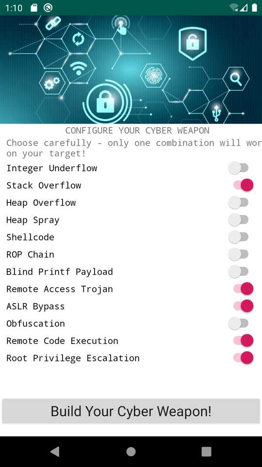

# Cyber Missile Commander

This challenge took me into some unfamiliar territory. I've dabbled a little
with Android Studio before, but never reverse engineered an APK before. It's
always great to learn something new!

We're given two things that are both necessary to solve the challenge: One is
an Android app, and the other is a Femtium binary that works as the key to
starting the Android app.

When starting the app, it gives us a 10-digit challenge code, that we can put
into the cmc-auth binary on the Fenix machine, and it spits out a 32-digit
response code that we enter in the app to proceed. We're then met with a
targeting screen that serves no real purpose, and after moving the crosshairs
or tapping the screen, we get to the "build your cyber weapon" screen. This
screen has 12 toggle switches and a submit button. When the switches are set
and the button is pressed, the app shows an errativ progress bar, and after a
few seconds switches to a success or fail view.


## Analysis

First I tried simply opening the APK file in Android Studio. The more recent
versions of Android Studio have the ability to open APK files directly, but it
didn't seem to do much good. Although it lets me easily run the app on an
Android device and inspect the Java byte code, it didn't appear to be possible
to set breakpoints in the code to really see what's going on, so aside from
using the IDE to quickly navigate between classes after decompiling the Java
bytecode, understanding the code mainly came down to static analysis.

I used [jadx](https://github.com/skylot/jadx) to decompile the contents of the
APK file. Of course, I quickly got tired of having to consult cmc-auth on Fenix
every time I wanted to run the app, so I started by looking at the challenge
and response code. That turned out to be a pretty bad idea, but more about that
later.

The response verification check appears to take place in the (name-obfuscated)
class b.b.a.a, in the static method `boolean a(String)`. Here, a check digit is
calculated over the first 31 digits of the response, and the last digit is
verified to be identical. If that's the case, the response is accepted and the
app starts:

```java
    public static boolean a(String str) {
        if (str.length() < 32) {
            return false;
        }
        int i = 0;
        for (char c : str.substring(0, str.length() - 1).toCharArray()) {
            i += c;
        }
        return ((i ^ 21) % 10) + 48 == str.charAt(str.length() - 1);
    }
```

To get an easy-to-type response that's always valid, we can simply run this
checksum for a response of, for example, all zeroes:

```
[tirsek@archlinux ~]$ perl -le 'print(((31*ord("0"))^21)%10)'
7
```

That makes it easy to get into the app, but causes problems later on.

When it comes to solving the 12 toggle switches, the interesting bits start in
the com/example/mycyber/EnterLaunchCode.java file. When this activity/view is
created, the class variable `r` contains the 12 switches, and `q` is loaded
with the 32-character response that was given to the challenge. When the button
is pressed, the code puts the value of the initial response string (via `q`) as
well as a textual binary representation of the state of the switches (`r`) into
a string array, and passes it to `cVar`, which is a an AsyncTask descendant:

```java
    String[] strArr = new String[2];
    strArr[0] = enterLaunchCode3.q;
    StringBuilder sb = new StringBuilder();
    while (true) {
        Switch[] switchArr2 = enterLaunchCode3.r;
        if (i < switchArr2.length) {
            sb.append(switchArr2[i].isChecked() ? '1' : '0');
            i++;
        } else {
            strArr[1] = sb.toString();
            cVar.execute(strArr);
            return;
        }
    }
```

Eventually, after some delays that are just for show, these two strings are
passed to the WinActivity:

```java
    Intent intent = new Intent(EnterLaunchCode.this.getApplicationContext(), WinActivity.class);
    intent.putExtra("response", strArr[0]);
    intent.putExtra("launchcodes", strArr[1]);
    EnterLaunchCode.this.startActivity(intent);
```

Among the resources distributed with the APK we also find a raw resource named
`encrypted_flag.png`. Inside the WinActivity, another static method from the
b.b.a.a class is called with the contents of this file, along with the two
strings from before; the response, and the text-binary representation of the
switches. This is where things start to get really interesting. First, the
`response` string, here referred to as `str` and subsequently as `bytes`, is
picked apart so as to only keep certain characters from the string:

```java
    public static int[] f581a = {0, 2, 3, 4, 6, 7, 8, 9, 11, 12, 13, 15, 16, 18, 20, 21, 22, 23, 24, 25, 26, 28, 29, 30};

    // ...

    byte[] bytes = str.getBytes();
    ByteArrayOutputStream byteArrayOutputStream2 = new ByteArrayOutputStream();
    for (int i : f581a) {
        if (i < bytes.length) {
            byteArrayOutputStream2.write(bytes[i]);
        }
    }
```

Then, a secret key is created using an SHA-256 hash of these 24 characters
along with the 12 characters from the string containing the switch states:

```java
    byte[] bytes2 = str2.getBytes();
    ByteArrayOutputStream byteArrayOutputStream = new ByteArrayOutputStream();
    // [... snip ...]
    byte[] byteArray = byteArrayOutputStream2.toByteArray();
    byteArrayOutputStream.write(byteArray, 0, byteArray.length); // partial response
    byteArrayOutputStream.write(bytes2, 0, bytes2.length);       // switch states
    try {
        MessageDigest instance = MessageDigest.getInstance("SHA-256");
        instance.update(byteArrayOutputStream.toByteArray());
        bArr = instance.digest();
    }
```


## Finding the encryption key

This secret key is then used to decrypt the PNG data using AES in CBC mode with
an all-zeroes IV, and with PKCS5 padding. If everything goes according to plan
and nothing throws an exception, the resulting PNG data is decoded as a bitmap.

```java
    SecretKeySpec secretKeySpec = new SecretKeySpec(bArr, "AES");
    Cipher instance2 = Cipher.getInstance("AES/CBC/PKCS5PADDING");
    instance2.init(2, secretKeySpec, new IvParameterSpec(new byte[]{0, 0, 0, 0, 0, 0, 0, 0, 0, 0, 0, 0, 0, 0, 0, 0}));
    byte[] doFinal = instance2.doFinal(byteArray2);
    return BitmapFactory.decodeByteArray(doFinal, 0, doFinal.length);
```

In other words, in order to decrypt the bitmap data, we need to find the
encryption key, consisting of 24 decimal digits followed by 12 binary digits.
The total number of combinations there is (10^24 * 2^12), or about 2^92. That is
definitely not feasible to brute force, so we'll have to limit the search space
significantly.

My first thought here was, that the first 24 digits can't exist in all the
possible combinations, because they are part of the response we get from just a
10-digit input. That reduces the search space to only about 4 * 10^13 or about
46 bits of entropy. While that's still a lot, it's almost within the realm of
possibility. I wrote a small program to benchmark my ability to brute force
this, and I came up with being able to test approximately 2.5 million keys per
second per core. Running it single-threaded would require about 190 CPU days,
and even splitting the workload up across eight cores would still require a few
weeks. Since this was the last challenge I worked on, I didn't really have a
few weeks, and brute forcing that large a keyspace didn't quite seem in the
spirit of a CTF either, so what did I miss? ...


## Eureka!

So I started looking at the authentictor tool a little closer. Feeding it a few
different inputs makes it clear that some of the digits either never change, or
rarely change:

```
noob@sphinx # for i in $(seq 10); do printf %010d $i | ./cmc-auth | tail -n 1; done
10792603665486552870963516749692
16792503665486852074963516709692
13792603664486252978963516789694
11792503664486652072963516759691
18792403663486052974963516739699
15792503663486452878963516799694
13792403664486752972963516759696
10792503663486152976963516749692
17792403663486552070963516709695
15792503662486952974963516789694
```

Let's examine this a little further. This runs 100 random 10-digit numbers
through the authenticator, then counts how many different digits ever appear in
the various positions of the 32-character output:

```sh
for i in $(seq 100); do
	printf '%05d%05d' $[($RANDOM*32768+$RANDOM)%100000] $[($RANDOM*32768+$RANDOM)%100000] |
	./cmc-auth | tail -n 1
done > responses.txt

for i in $(seq 32); do printf '%2d: %2d\n' $i $(cut -b$i responses.txt | sort -u | wc -l); done
```

The result shows where the fixed digits are (shown as '1' in the result), and
the variable digits (shown as '10').

```
 1:  1
 2: 10
 3:  1
 4:  1
 5:  1
 6: 10
 7:  1
 8:  1
 9:  1
10:  1
11: 10
12:  1
13:  1
14:  1
15: 10
16:  1
17:  1
18: 10
19:  1
20: 10
21:  1
22:  1
23:  1
24:  1
25:  1
26:  1
27:  1
28: 10
29:  1
30:  1
31:  1
32: 10
```

When we compare this list to the `f581a` array above, it turns out that the
fixed digits are in _exactly_ the same positions as the ones the code picks out
as part of the encryption key. Aha! That means we can consider those 24 digits
as a fixed string:

```
19792803662486152478963516769692 => 179203664865279635167969
^ ^^^ ^^^^ ^^^ ^^ ^ ^^^^^^^ ^^^
```

That in turn reduces the search space from trillions of combinations to only
the 4096 different combinations we get from the 12 switches. Now _that_ we can
brute force with ease! Here's a short C program that uses OpenSSL to decrypt
the first block of ciphertext, and compares the first 8 bytes of the resulting
plaintext to a known PNG header to find the answer:

```c
#include <assert.h>
#include <openssl/evp.h>
#include <openssl/sha.h>
#include <stdint.h>
#include <stdio.h>
#include <string.h>
#include <unistd.h>

static uint8_t ciphertext[16] = "\x1f\x0b\x19\x7f\x5e\x1f\x52\x6f\x00\xda\x77\xf7\x72\x0e\x35\xdf";
static uint8_t png_header[8] = {137, 80, 78, 71, 13, 10, 26, 10};

static int try_one(uint8_t *key)
{
	uint8_t digest[SHA256_DIGEST_LENGTH];

	SHA256(key, 36, digest);

	EVP_CIPHER_CTX *ctx = EVP_CIPHER_CTX_new();

	if (!EVP_DecryptInit_ex(ctx, EVP_aes_256_ecb(), NULL /* impl */, digest, NULL /* iv */)) {
		fprintf(stderr, "Fail 1\n");
		exit(1);
	}

	EVP_CIPHER_CTX_set_padding(ctx, 0);

	assert(EVP_CIPHER_CTX_iv_length(ctx) == 0);
	assert(EVP_CIPHER_CTX_key_length(ctx) == SHA256_DIGEST_LENGTH);
	assert(EVP_CIPHER_CTX_block_size(ctx) == sizeof(ciphertext));

	uint8_t plaintext[sizeof(ciphertext)];
	int outl = 0;

	if (!EVP_DecryptUpdate(ctx, plaintext, &outl, ciphertext, sizeof(ciphertext)) || outl != sizeof(ciphertext)) {
		fprintf(stderr, "Fail2 (%d)\n", outl);
		exit(1);
	}

	return memcmp(plaintext, png_header, sizeof(png_header)) == 0;
}

int main()
{
	uint8_t key[36] = "179203664865279635167969000000000000";

	for (int i=0; i<4096; i++) {
		for (int j=0; j<12; j++) {
			key[24+j] = !!(i & 1<<j) + '0';
		}
		if (try_one(key)) {
			printf("Found: %s\n", key);
			break;
		}
	}

	exit(0);
}
```

```
[tirsek@archlinux cybermc]$ gcc -std=gnu99 -O2 bruteforce.c -o bruteforce -lcrypto
[tirsek@archlinux cybermc]$ ./bruteforce
Found: 179203664865279635167969010000011011
```

At this point, we could decrypt the whole PNG file separately, or just toggle
the switches as needed in the app and see what happens:




## Flag

`FE{You_are_now_a_developer!}`


---
_Peter Tirsek, 2020-01-25_
