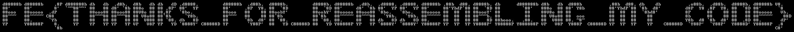

# Dumpster Dive

We're given a PDF, which when opened in a normal PDF viewer simply says
"I attached/embedded some source code found in the trash...". The PDF
file actually contains a nested PDF file with a tiny bit of javascript
source code as well as another PDF file. This nested structure is
almost 500 levels deep.

First I tried a recursive binwalk of the PDF to extract the data
embedded within, but that turned out to be incredibly resource
intensive. Instead, I switched to a much more lightweight solution
using `pdfdetach` from [Poppler](https://poppler.freedesktop.org/) in a
bash one-liner (here broken up for readability):

```sh
i=1; file=dumpster_dive.pdf; while true; do
	next=$(printf "%03d.pdf" $i); echo $next; i=$[$i+1];
	pdfdetach -save 1 -o $next $file || break; file=$next;
done
```

This unpacks the nested structure into 490 new PDF files. The last
attachment saved as 491.pdf is actually a plain javascript file
containing a copy of the jQuery library. We'll rename that one to
`jquery.js`.

```sh
mv 491.pdf jquery.js
```

When opening some of the remaining PDF files in the normal PDF viewer,
each file contains a header saying, for example, "387 of 490" in
001.pdf, as well as a line of program code. We'll have to extract these
lines, and put them back in the correct order, in order to recover the
program.

I tried to do that using `pdftotext`, also from Poppler, but it turns
out that pdftotext is not good at maintaining the number of spaces
embedded in the PDF text, and that turns out to be important for the
end result.

Instead, I ended up extracting the first zlib-compressed stream from
each PDF using a simple `awk` script, decompressing it with `zpipe`,
and picking out the sequence number and associated program code with
`sed`, rearranging the pieces back in order using `sort`, and finally
discarding the sort key, all in another beautiful bash one-liner, again
broken up for readability:

```sh
for a in ???.pdf; do
	awk '/^endstream/{exit} ok{print} /^stream$/{ok=1}' $a | zpipe -d |
	sed 's/^.* Td (\([0-9]*\) of 490).* Td (\(.*\))Tj ET *$/\1\t\2\n/; s/\\\([\\()]\)/\1/g'
done | tee /dev/stderr | sort -n | cut -f2 > dumpster_dive_assembled.html
```

The final [dumpster_dive_assembled.html](dumpster_dive_assembled.html)
file can then be opened in a browser, and the javascript code will
spell out the flag in amazingly 1990s ASCII art.
[Figlet](http://www.figlet.org/) anyone? Looks like the
"[basic](http://www.figlet.org/fontdb_example.cgi?font=basic.flf)"
font.

```
d88888b d88888b    .8P d888888b db   db  .d8b.  d8b   db db   dD .d8888.         d88888b  .d88b.  d8888b.         d8888b. d88888b  .d8b.  .d8888. .d8888. d88888b .88b  d88. d8888b. db      d888888b d8b   db  d888b          .88b  d88. db    db          .o88b.  .d88b.  d8888b. d88888b V8.
88'     88'        8'  `~~88~~' 88   88 d8' `8b 888o  88 88 ,8P' 88'  YP         88'     .8P  Y8. 88  `8D         88  `8D 88'     d8' `8b 88'  YP 88'  YP 88'     88'YbdP`88 88  `8D 88        `88'   888o  88 88' Y8b         88'YbdP`88 `8b  d8'         d8P  Y8 .8P  Y8. 88  `8D 88'      `8
88ooo   88ooooo  .dP      88    88ooo88 88ooo88 88V8o 88 88,8P   `8bo.           88ooo   88    88 88oobY'         88oobY' 88ooooo 88ooo88 `8bo.   `8bo.   88ooooo 88  88  88 88oooY' 88         88    88V8o 88 88              88  88  88  `8bd8'          8P      88    88 88   88 88ooooo   Vb.
88~~~   88~~~~~ C88       88    88~~~88 88~~~88 88 V8o88 88`8b     `Y8b.         88~~~   88    88 88`8b           88`8b   88~~~~~ 88~~~88   `Y8b.   `Y8b. 88~~~~~ 88  88  88 88~~~b. 88         88    88 V8o88 88  ooo         88  88  88    88            8b      88    88 88   88 88~~~~~    88D
88      88.      `Yb      88    88   88 88   88 88  V888 88 `88. db   8D         88      `8b  d8' 88 `88.         88 `88. 88.     88   88 db   8D db   8D 88.     88  88  88 88   8D 88booo.   .88.   88  V888 88. ~8~         88  88  88    88            Y8b  d8 `8b  d8' 88  .8D 88.       dP'
YP      Y88888P    8.     YP    YP   YP YP   YP VP   V8P YP   YD `8888Y' C88888D YP       `Y88P'  88   YD C88888D 88   YD Y88888P YP   YP `8888Y' `8888Y' Y88888P YP  YP  YP Y8888P' Y88888P Y888888P VP   V8P  Y888P  C88888D YP  YP  YP    YP    C88888D  `Y88P'  `Y88P'  Y8888D' Y88888P  .8
                   `8b                                                                                                                                                                                                                                                                      C8'
```

… or in a slightly more era-appropriate font:




## Flag

`FE{THANKS_FOR_REASSEMBLING_MY_CODE}`


---
_Peter Tirsek, 2020-01-20_
