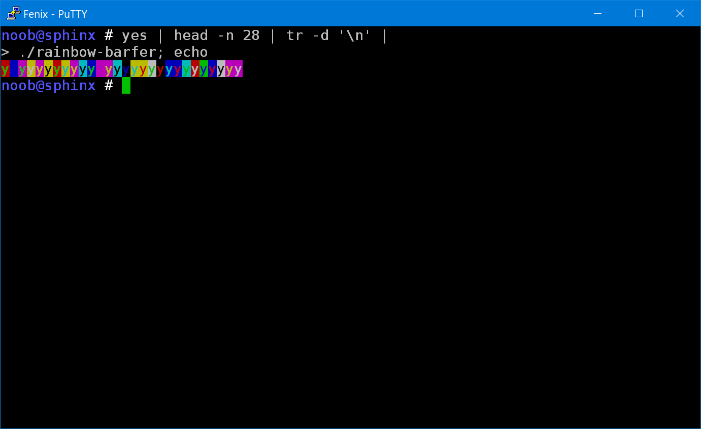

# Rainbowbarf

The `rainbow-barfer` executable takes plain text on standard input and
returns the same text on standard output, but adorned with seemingly
random colors using standard ANSI escape sequences.



The colors repeat every 28 characters, so only the first 28 characters
are relevant. Since ANSI colors allow for 8 foreground colors and 8
background colors, and given the hint that "It's Base to know 8*8 is
64", it's pretty obvious that we're meant to take the foreground and
background color codes, and use them as an index into a table of base64
characters. We can do this within Fenix with a little `sed` and `awk`
magic, for example:

```sh
yes | head -n 28 | tr -d '\n' | ./rainbow-barfer |
sed 's/\e\[0m$//;s/\e\[\(..\);\(..\)m./\1 \2\n/g' |
awk '{
   printf("%s",
     substr("ABCDEFGHIJKLMNOPQRSTUVWXYZabcdefghijklmnopqrstuvwxyz0123456789+/",
     ($1-30)*8 + ($2-40) + 1, 1))
}' | base64 -d; echo
```

Flag: `FE{t4ste-th3-r41nb0w}`


---
_Peter Tirsek, 2020-01-20_
